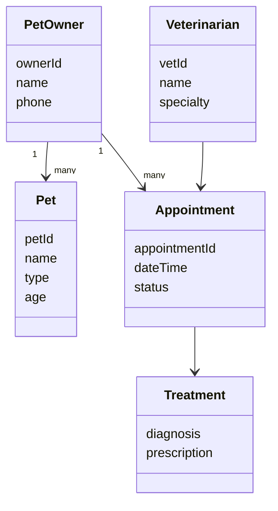

```mermaid
classDiagram
    class PetOwner {
        ownerId
        name
        phone
    }

    class Pet {
        petId
        name
        type
        age
    }

    class Appointment {
        appointmentId
        dateTime
        status
    }

    class Veterinarian {
        vetId
        name
        specialty
    }

    class Treatment {
        diagnosis
        prescription
    }

    PetOwner "1" --> "many" Pet
    PetOwner "1" --> "many" Appointment
    Veterinarian --> Appointment
    Appointment --> Treatment
```
